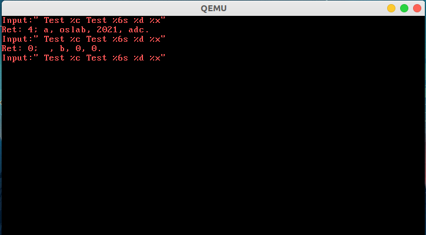
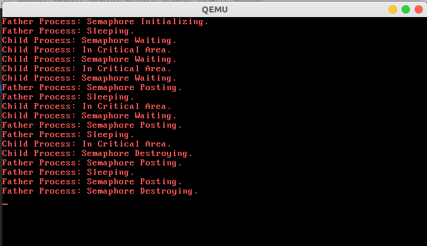
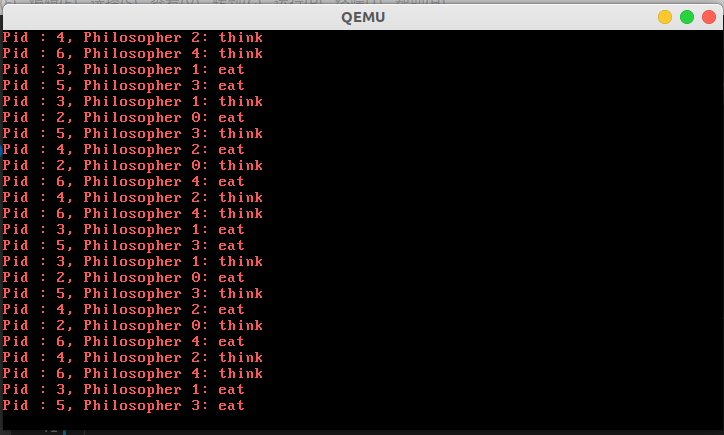

# Lab4实验报告

邢存远 191300064@smail.nju.edu.cn

## 前言

本次实验的主题是信号量与PV操作，并基于此解决5个哲学界就餐问题。基于实验手册，我们可以在一些步骤上节省不少时间。我们这次采用的是$\text{Ubuntu16.04}$平台，使用$\text{TODO Tree}$进行任务搜寻和$\text{git}$进行版本控制。实验难度不大，但在调试上花去了不少时间。

## 格式化输入函数(scanf)的实现

在[lab2](https://welts.xyz/2021/04/09/lab2/)中，我们已经实现了格式化输出函数，但没有实现真正功能完备的格式化输入函数，这是因为基于中断的`scanf`需要进行进程同步，而这个在前面的实验中没有涉及。我们首先需要实现一个`scanf`函数并通过程序测试：当我们输入`Test a Test oslab 2021 0xadc`，屏幕上会输出`Ret: 4; a, oslab, 2021, adc`。

### 任务目标

好在为了降低实验难度，`scanf`的框架已经完成，我们只需要完成中断处理例程。借助$\text{TODO Tree}$，我们找到了实现位置：

1. 处理好键盘中断，也就是在无法立刻获得键盘资源时，进程阻塞时的处理：

   ```cpp
   void keyboardHandle(struct StackFrame *sf) {
       ProcessTable *pt = NULL;
       uint32_t keyCode = getKeyCode();
       if (keyCode == 0)  // illegal keyCode
           return;
       // putChar(getChar(keyCode));
       keyBuffer[bufferTail] = keyCode;
       bufferTail = (bufferTail + 1) % MAX_KEYBUFFER_SIZE;

       if (dev[STD_IN].value < 0) {  // with process blocked
                                     // TODO: deal with blocked situation
       }

       return;
   }
   ```

2. 标准流输入的系统调用，这里也需要对进程阻塞进行额外的处理：

```cpp
void syscallReadStdIn(struct StackFrame *sf) {
    // TODO: complete `stdin`
}
```

### 解决方案

这次实验框架设计的巧妙之处在于，它将设备抽象成一种资源，从而在设计上与“信号量”极为相似：

```cpp
struct Semaphore {
    int state;
    int value;
    struct ListHead pcb; // link to all pcb ListHead blocked on this semaphore
};
typedef struct Semaphore Semaphore;

struct Device {
    int state;
    int value;
    struct ListHead pcb; // link to all pcb ListHead blocked on this device
};
typedef struct Device Device;

Semaphore sem[MAX_SEM_NUM];
Device dev[MAX_DEV_NUM];
```

在操作系统中，我们不可能通过一直监听键盘中断来进行输入，这样太浪费系统资源了，所以我们需要一个键盘输入缓冲区和类似信号量的东西来实现条件同步，在键盘中断将输入存入缓冲区后再让用户程序读取，所以代码中定义了Device，他其实就是信号量，只不过不能由用户通过系统调用控制，而是直接和硬件绑定。一个信号量由其状态，值（value）和等待队列构成，设备亦然。

所以，对于`keyboardHandle`，当进程阻塞（也就是设备信号量的值为负），我们进行的是类似PV操作中的V操作：

```cpp
if (dev[STD_IN].value < 0) {
    // v.value++
    dev[STD_IN].value++;

    // 从信号量i上阻塞的进程列表取出一个进程
    // 这里不是信号量(sem)，而是设备(dev)，注意区分
    pt = (ProcessTable*)((uint32_t)(dev[i].pcb.prev) -
                    (uint32_t)&(((ProcessTable*)0)->blocked));
    dev[i].pcb.prev = (dev[i].pcb.prev)->prev;
    (dev[i].pcb.prev)->next = &(dev[i].pcb);

    // 进程被激活唤醒
    pt->state = STATE_RUNNABLE; 
    pt->sleepTime = 0;
}
```

类似的，在`syscallReadStdIn`中，我们需要占用输入设备资源，所以对应的是PV操作中的P：

```cpp
void syscallReadStdIn(struct StackFrame *sf) {
    if (dev[STD_IN].value == 0) {
        // 信号量减一
        dev[STD_IN].value--;

        // 将current线程加到信号量i的阻塞列表
        pcb[current].blocked.next = dev[STD_IN].pcb.next;
        pcb[current].blocked.prev = &(dev[STD_IN].pcb);
        dev[STD_IN].pcb.next = &(pcb[current].blocked);
        (pcb[current].blocked.next)->prev = &(pcb[current].blocked);

        // 阻塞线程
        pcb[current].state = STATE_BLOCKED;
        pcb[current].sleepTime = -1;  // blocked on STD_IN
        asm volatile("int $0x20");

        // 获取相关信息
        int sel = sf->ds;
        char *str = (char *)sf->edx;
        int size = sf->ebx;  // MAX_BUFFER_SIZE, reverse last byte
        int i = 0;
        char character = 0;
        asm volatile("movw %0, %%es" ::"m"(sel));

        // 处理键盘输入
        while (i < size - 1) {
            if (bufferHead != bufferTail) {
                character = getChar(keyBuffer[bufferHead]);
                bufferHead = (bufferHead + 1) % MAX_KEYBUFFER_SIZE;
                // putChar(character);
                if (character != 0) {
                    asm volatile("movb %0, %%es:(%1)" ::"r"(character),
                                 "r"(str + i));
                    i++;
                }
            } else
                break;
        }
        asm volatile("movb $0x00, %%es:(%0)" ::"r"(str + i));
        pcb[current].regs.eax = i;
        return;
    } else if (dev[STD_IN].value < 0) { // 进程仍然堵塞
        pcb[current].regs.eax = -1;
        return;
    }
}
```

至此我们已经完整实现了`scanf`，接下来是测试环节：



## 信号量相关系统调用的实现

我们将实现`SEM_INIT`、`SEM_POST`、`SEM_WAIT`、`SEM_DETROY`系统调用，分别用于信号量初始化、V操作、P操作和释放信号量。并进行用户测试。

其中，系统调用函数`systemSemWait`和`systemSemPost`对应P操作和V操作，参考实验手册和教材上的伪码即可实现，而`syscallSemInit`将所有的信号量进行状态，值以及进程队列的初始化：

```cpp
void syscallSemInit(struct StackFrame *sf) {
    int i;
    for (i = 0; i < MAX_SEM_NUM; i++) {
        if (sem[i].state == 0) break;
    }
    if (i != MAX_SEM_NUM) {
        sem[i].state = 1;
        sem[i].value = (int32_t)sf->edx;
        sem[i].pcb.next = &(sem[i].pcb);
        sem[i].pcb.prev = &(sem[i].pcb);
        pcb[current].regs.eax = i;
    } else
        pcb[current].regs.eax = -1;
    return;
}
```

而在`syscallSenDestroy`中，我们需要将仍在使用的信号量销毁：

```cpp
void syscallSemDestroy(struct StackFrame *sf) {
    int i = sf->edx;
    if (sem[i].state == 1) {
        pcb[current].regs.eax = 0;
        sem[i].state = 0;
        asm volatile("int $0x20");
    } else
        pcb[current].regs.eax = -1;
    return;
}
```

我们可以运行测试：



通过源码和输出，我们可以解释这段测试程序：

1. 父进程（生产者）初始定义了一个值为`2`的信号量`value`，然后睡眠，子进程（消费者）因此可以进入临界区两次，之后子进程睡眠；
2. 子进程睡眠会唤醒父进程，父进程会将信号量加一，继续睡眠，子进程又可以进入临界区一次；
3. 上面的循环一直持续到子进程访问了4次临界区.

## 基于信号量解决哲学家就餐问题

哲学家就餐问题可以这样表述，假设有五位哲学家围坐在一张圆形餐桌旁，做以下两件事情之一：吃饭，或者思考。吃东西的时候，他们就停止思考，思考的时候也停止吃东西。餐桌中间有一大碗义大利面，每位哲学家之间各有一支餐叉。因为用一支餐叉很难吃到义大利面，所以假设哲学家必须用两支餐叉吃东西。他们只能使用自己左右手边的那两支餐叉。

> 哲学家就餐问题有时也用米饭和五根筷子而不是意大利面和餐叉来描述，因为吃米饭必须用两根筷子。

我们采用实验手册上最全面的PV操作算法来解决这个问题，它既没有死锁，也允许多人就餐：

```cpp
#define N 5                // 哲学家个数
semaphore fork[5];         // 信号量初值为1
void philosopher(int i){   // 哲学家编号：0-4
  while(TRUE){
    think();               // 哲学家在思考
    if(i%2==0){
      P(fork[i]);          // 去拿左边的叉子
      P(fork[(i+1)%N]);    // 去拿右边的叉子
    } else {
      P(fork[(i+1)%N]);    // 去拿右边的叉子
      P(fork[i]);          // 去拿左边的叉子
    }
    eat();                 // 吃面条
    V(fork[i]);            // 放下左边的叉子
    V(fork[(i+1)%N]);      // 放下右边的叉子
  }
}
```

为了更好观察实验结果，我们规定，每个原语（P，V操作，吃和思考）之间都会有一个`sleep(128)`语句。

那么我们不难用程序模拟这个问题：

```cpp
#define N 5

void philosopher(int id, sem_t* forks) {
    pid_t pid = getpid();
    while (1) { // 不断循环：思考->拿餐具->吃
        printf("Pid : %d, Philosopher %d: think\n", pid, id);
        sleep(128);
        if (id % 2 == 0) {
            sem_wait(forks + id);
            sleep(128);
            sem_wait(forks + (id + 1) % N);
        } else {
            sem_wait(forks + (id + 1) % N);
            sleep(128);
            sem_wait(forks + id);
        }
        sleep(128);
        printf("Pid : %d, Philosopher %d: eat\n", pid, id);
        sleep(128);
        sem_post(forks + id);
        sleep(128);
        sem_post(forks + (id + 1) % N);
    }
}

int uEntry(void) {
    sem_t forks[N];
    for (int i = 0; i < N; i++) {
        sem_init(forks + i, 1);   // 信号量初始化
    }
    for (int i = 0; i < N; i++) {
        if (fork() == 0) {
            philosopher(i, forks);// 五个子进程用于模拟五个哲学家
        }
    }
    while (1)
        ;
    for (int i = 0; i < N; i++) {
        sem_destroy(forks + i);   // 回收信号量
    }
    return 0;
}
```

### 框架的问题

我们如果用目前的框架运行上面的模拟程序，其实是行不通的：只能看到只有2个哲学家在吃饭和思考，那么原因大概是框架无法`fork`出多个进程。在使用自己写的程序对`fork`进行测试后，发现确实无法产生3个以上进程。

我们追溯到`syscallFork`，发现进程生成数量收到`MAX_PCB_NUM`的限制，此时它的值是4，算上父进程，这正解释上述现象发生的原因，我们将其扩大到10，这样就不会对我们的程序造成影响。

受此启发，我检查了`MAX_SEM_NUM`，发现它的值设置为4，也就是说框架只允许4个信号量发挥作用，而我们的哲学家问题需要5个信号量，于是我们将其扩展至5。

> 这大概就是手册中所说的”不要盲目相信框架代码，框架代码只在有限范围内正确“。

这时我们运行模拟程序，就可以看到哲学家们正在思考和进食：



至此我们完成了全部实验内容。

## 总结

这次实验是对课堂上信号量与PV操作的一次复习和实践，让我加深了对知识点的理解；此外，发现框架的问题、寻找原因、到最后解决问题的流程让我收获良多。
